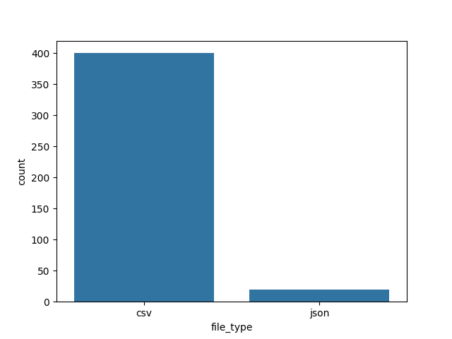
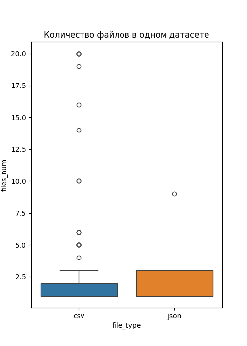
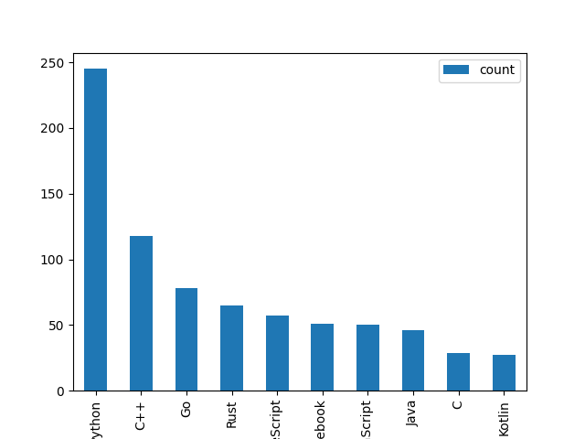

## Практическая работа 1. Начало работы с API

### Программные средства сбора, консолидации и аналитики данных

**Цель  работы:**
получить углубленные навыки программного сбора и анализа
данных из различных веб-источников с помощью API. Работа направлена на
решение прикладных бизнес-задач в области анализа больших данных, технологий
и рыночных тенденций.

**Ссылка на Git-репозиторий:** *https://github.com/GuzelN-4labs/PW_1_API_Analysis.git*

#### Вариант задания: 16

1. Анализ популярности форматов: сравнить количество датасетов с файлами .csv и .json по теме "streaming".
2. Анализ языков в организации: выбрать крупную IT-компанию (например, Google) и проанализировать, какие
языки программирования наиболее популярны в ее публичных репозиториях.
3. Анализ профессиональных ролей: для 100 вакансий "BI Analyst" проанализировать, какие
другие названия должностей встречаются в тексте вакансии.

**Задание 1**. **  Анализ популярности форматов: сравнить количество датасетов с файлами .csv и .json по теме "streaming".**
   Сначала были собраны датасеты, содержащие в названии / описании 'streaming'.  Цель - проверить на наличие таких датасетов, возможность скрейпить с нескольких страниц сайта, какие параметры датасетов можно при этом получить.
  Для этого использовался цикл со следующим запросом к api: `kaggle.api.dataset_list(search='streaming', page=page_number)`

   

   

 Далее был произведен парсинг сайта на 10 страницах и посчитано количество файлов формата .csv и .json:
  1) для этого произведен сбор датасетов на 10 страницах при помощи команды   `kaggle.api.dataset_list(search='streaming', page=page_number)`
   2) после чего, на основе списка датасетов, произведен сбор файлов   `kaggle.api.dataset_list_files(dataset.ref).files`

     num_pages = 10
     
     # Список для хранения всех файлов и информации о датасетах
     all_files_and_datasets = []
     all_datasets2 = []
     
     # Цикл по страницам и датасетам для получения списка файлов
     for page_number in range(1, num_pages + 1):
         current_page_datasets = kaggle.api.dataset_list(search='streaming', page=page_number)
         all_datasets2.extend(current_page_datasets)
         for dataset in current_page_datasets:
             try:
                 files = kaggle.api.dataset_list_files(dataset.ref).files
                 for file in files:
                     file_info = vars(file)
                     file_info['dataset_ref'] = dataset.ref # Добавляем ссылку на датасет к информации о файле
                     all_files_and_datasets.append(file_info)
             except Exception as e:
                 print(f"Error listing files for dataset {dataset.ref}: {e}")
              # Вежливая задержка между запросами
             time.sleep(1)
     
     # Преобразуем в DataFrame для удобства
     df_streaming_files = pd.DataFrame(all_files_and_datasets) # датасет с файлами и реф.датасета kaggle
     df_streaming2 = pd.DataFrame([vars(c) for c in all_datasets2]) # датасет с основными с данными по датасету kaggle
     # Считаем количество файлов с расширением .csv и .json
     csv_count = sum(1 for file_info in all_files_and_datasets if file_info['_name'].lower().endswith('.csv')) # исправлено название столбца на "_name"
     json_count = sum(1 for file_info in all_files_and_datasets if file_info['_name'].lower().endswith('.json')) # исправлено название столбца на "_name"

     print(f"Количество .csv файлов: {csv_count}")
     print(f"Количество .json файлов: {json_count}")

> *официальная документация по парсингу kaggle:* *https://github.com/Kaggle/kaggle-api/blob/main/documentation/datasets.md*

В результате парсинга 10 странци было найдено 411 csv-файлов и 19 json-файлов
 

В большинстве случаев в одном датасете содержится 1 файл (csv // json).

**Вывод по Заданию 1:**
- Была собрана информация с 10 страниц сайта, по датасетам, относящимся к тематике 'streaming'. На собранных данных нашлось 411 csv-файлов, 19 - json-файлов
- среди собранных данных не было датасетов, содержащих как csv, так и json файлы
- в большинстве случаев в одном датасете содержится по одному файлу. При этом (по собранным данным), разброс количества csv-файлов - от 1 до 20, json - от 1 до 9
- количество загрузок csv-файлов значительно превышает количество загрузок json

**Задание 2.**
 **Анализ языков в организации: выбрать крупную IT-компанию (например, Google) и проанализировать, какие языки программирования наиболее популярны в ее публичных репозиториях.**
  Сначала была призведена аутентификация в GitHub API, а затем парсинг 10 страниц с репозиториями Google

     # Search for repositories belonging to the 'Google' organization
     languages_list = []
     pages = 10
     per_page = 100 # Maximum allowed per page
     
     # Iterate through pages
     for page in range(1, pages + 1):
         params = {"sort": "stars", "order": "desc", "per_page": per_page, "page": page}
         response = requests.get(f"{GITHUB_API_URL}/orgs/google/repos", params=params, headers=headers)
     
         # Check if the request was successful
         if response.status_code == 200:
             repos = response.json()
             # Extract languages from each repository
             for repo in repos:
                 language = repo.get('language')
                 if language: # Only add if language is not None
                     languages_list.append(language)
         else:
             print(f"Error fetching data from page {page}: {response.status_code}")
             break # Stop if there's an error
  

  Далее произведен подсчет использованных языков программирования
 

**Вывод по Заданию 2:**
 Используя GitHub API, определили:

*   в репозиториях Google используется 43 языка
*   Самый популярный из них - Python (26% от общего количества)
*   В топ-5 самых популярных языков входят: 'Python', 'C++', 'Go', 'Rust', 'TypeScript'

**Задание 3**
 **Анализ профессиональных ролей: для 100 вакансий "BI Analyst" проанализировать, какие другие названия должностей встречаются в тексте вакансии.**

3.1. Сбор данных и анализ

    import time
    from collections import Counter
    
    HH_API_URL = "https://api.hh.ru/vacancies"
    all_vacancies = []
    pages_to_load = 5 # 100 вакансий (по 20 на странице)
    
    params = {
        'text': 'BI Analyst',
        'area': 1, # Москва
        'per_page': 20
    }
    
    for page in range(pages_to_load):
        params['page'] = page
        response = requests.get(HH_API_URL, params=params)
        if response.status_code == 200:
            vacancies_data = response.json()
            all_vacancies.extend(vacancies_data['items'])
            print(f"Загружена страница {page + 1}/{pages_to_load}")
        else:
            print(f"Ошибка при загрузке страницы {page + 1}: {response.status_code}")
            break
        time.sleep(0.2) # Соблюдаем вежливость к API
    
    print(f"\nВсего найдено вакансий: {len(all_vacancies)}")

  3.2. Вывод наименований должностей, которые также содержатся в вакансии BI Analyst

  Гипотеза почему они также встречаются при поиске BI Analyst: общие soft skills
  Проверка гипотезы

**Вывод по Заданию 2:**
- в тексте вакансий встречается много других должностей, содержащих слова "аналитик" и/или "BI", также такие должности как: "Директор по продажам/Коммерческий директор (FMCG)", "Директор по маркетингу / CMO", "Менеджер по работе с маркетплейсом OZON", "Финансовый руководитель".
- Эти должности с вакансией "BI-аналитик" объединяют ключевые навыки, в топе которых:
 1. sql
 2. power bi
 3. аналитическое мышление
 4. python
 5. анализ данных

